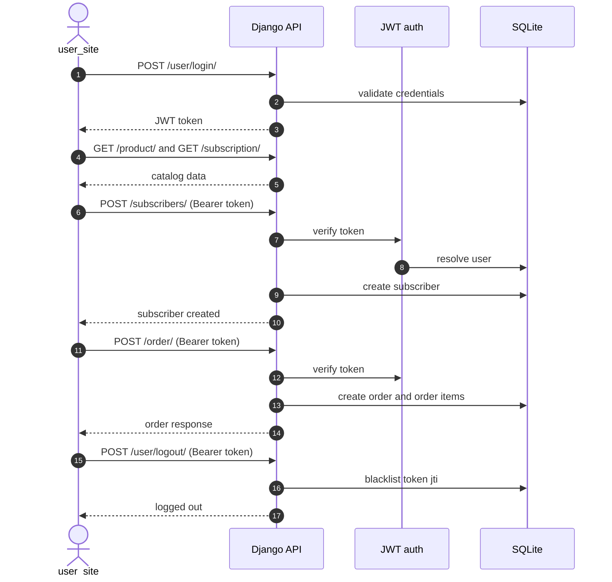
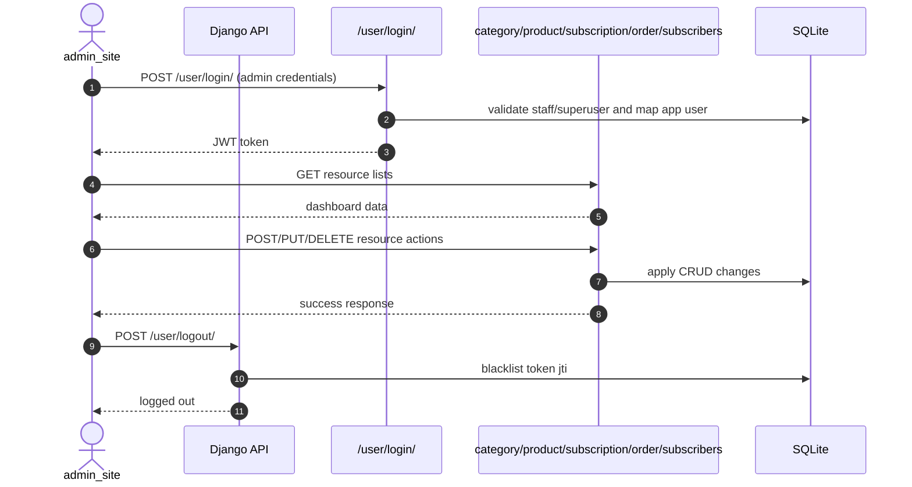

# Milkman Full Stack Project

Milkman is a full-stack subscription and ordering application with:

- Django + Django REST Framework backend (`milkman/backend`)
- React + Vite admin frontend (`milkman/frontend/admin_site`)
- React + Vite user frontend (`milkman/frontend/user_site`)

The backend exposes APIs for users, products, categories, subscriptions, subscribers, orders, and order items, using custom stateless JWT authentication.

## API Documentation

- Swagger UI: `http://localhost:8000/swagger/`
- OpenAPI schema (JSON): `http://localhost:8000/api/schema/`
- ReDoc: `http://localhost:8000/redoc/`
- Postman collection: `milkman/backend/Milkman_API.postman_collection.json`

## Tech Stack

### Backend

- Python 3.11+
- Django 5.2.11
- Django REST Framework 3.16.1
- django-cors-headers 4.7.0
- Pillow 11.3.0
- SQLite (default: `milkman/backend/db.sqlite3`)

### Frontend

- React 18
- Vite 5
- TailwindCSS (both frontends)
- Bootstrap (admin site)

## Repository Structure

```text
milkman/
  backend/
    config/           # Django settings, root urls, WSGI/ASGI
    user/             # app user model, JWT auth/login/logout
    category/         # category CRUD
    product/          # product CRUD + image upload
    subscription/     # subscription plan CRUD
    subscribers/      # user subscription ownership + subscription checkout
    order/            # order checkout/list/update/delete
    order_item/       # individual order-item endpoints
  frontend/
    admin_site/       # admin React app
    user_site/        # customer React app
requirements.txt      # Python dependencies
```

## Quick Start

### 1. Backend Setup (Windows PowerShell)

```powershell
Set-Location D:\FullStackProject
python -m venv .venv
& .\.venv\Scripts\Activate.ps1
pip install -r requirements.txt
Set-Location .\milkman\backend
python manage.py migrate
python manage.py runserver 0.0.0.0:8000
```

Backend base URL: `http://localhost:8000`

### 2. Backend Setup (macOS/Linux)

```bash
cd /path/to/FullStackProject
python3 -m venv .venv
source .venv/bin/activate
pip install -r requirements.txt
cd milkman/backend
python manage.py migrate
python manage.py runserver 0.0.0.0:8000
```

### 3. Run Frontend Apps

Admin site:

```powershell
Set-Location D:\FullStackProject\milkman\frontend\admin_site
npm install
npm run dev
```

User site:

```powershell
Set-Location D:\FullStackProject\milkman\frontend\user_site
npm install
npm run dev
```

## Run All Services With PM2

This repository now includes a root PM2 ecosystem file: `ecosystem.config.cjs`.

Managed apps:

- `milkman-backend` (Django on `0.0.0.0:8000`)
- `milkman-admin-site` (Vite dev server on `0.0.0.0:5174`)
- `milkman-user-site` (Vite dev server on `0.0.0.0:5173`)

### 1. Prerequisites

- Create and activate the project virtual environment (`.venv`)
- Install backend dependencies (`pip install -r requirements.txt`)
- Install frontend dependencies in both frontend apps (`npm install`)
- Install PM2 globally:

```bash
npm install -g pm2
```

### 2. Start all apps with PM2

From repository root (`D:\FullStackProject`):

```bash
pm2 start ecosystem.config.cjs
pm2 status
```

### 3. Useful PM2 commands

```bash
pm2 logs
pm2 logs milkman-backend
pm2 restart milkman-backend
pm2 restart milkman-admin-site
pm2 restart milkman-user-site
pm2 stop all
pm2 delete all
```

### 4. Persist processes across reboot

```bash
pm2 save
pm2 startup
```

Notes:

- Backend uses the project virtualenv Python (`.venv/Scripts/python.exe` on Windows, `.venv/bin/python` on macOS/Linux).
- Frontends run via `npm run dev` with fixed ports and `--strictPort`.

## Authentication Model

- Login endpoint: `POST /user/login/`
- Returns JWT + mapped app `user_id`
- Token is sent as: `Authorization: Bearer <token>`
- DRF default auth class: `user.auth.JWTAuthentication`
- Logout endpoint blacklists JWT `jti`: `POST /user/logout/`
- Access token expiry: 60 minutes (from login implementation)

Notes:

- Login accepts either `email` or `username`.
- If a Django staff/superuser logs in successfully, the backend maps that account to an app-level `user.User` record.

## API Routing Overview

Root routes from `config/urls.py`:

- `/api/schema/`
- `/swagger/`
- `/redoc/`

- `/user/`
- `/category/`
- `/product/`
- `/subscription/`
- `/subscribers/`
- `/order/`
- `/order_item/`

## Endpoint Reference

### User

- `GET /user/` list app users
- `POST /user/` create app user
- `GET /user/<id>/` retrieve user
- `PUT /user/<id>/` update user
- `DELETE /user/<id>/` delete user
- `GET /user/admin-users/` list Django auth users
- `POST /user/login/` login and receive JWT
- `POST /user/logout/` revoke JWT (requires bearer token)

### Category

- `GET /category/`
- `POST /category/`
- `PUT /category/<id>/`
- `DELETE /category/<id>/`

### Product

- `GET /product/`
- `POST /product/` (supports multipart for image upload)
- `PUT /product/<id>/`
- `DELETE /product/<id>/`

### Subscription

- `GET /subscription/`
- `POST /subscription/`
- `GET /subscription/<id>/`
- `PUT /subscription/<id>/`
- `DELETE /subscription/<id>/`

### Subscribers (Authenticated)

- `GET /subscribers/` list own subscribers (admin/staff-mapped users can view all)
- `POST /subscribers/` create subscriber for current user
- `GET /subscribers/<id>/`
- `PUT /subscribers/<id>/`
- `DELETE /subscribers/<id>/`
- `POST /subscribers/checkout/` mark one or more subscriber plans as paid and create order records

### Orders (Authenticated)

- `GET /order/` list orders
- `POST /order/` create order using checkout payload
- `GET /order/<id>/` retrieve order
- `PUT /order/<id>/` partial update order
- `DELETE /order/<id>/` delete order
- `PUT /order/update/<id>/` update order (alternate route)
- `DELETE /order/delete/<id>/` delete order (alternate route)

### Order Items

- `GET /order_item/`
- `POST /order_item/`
- `GET /order_item/<id>/`
- `PUT /order_item/<id>/`
- `DELETE /order_item/<id>/`

## Example Payloads

Create user:

```json
{
  "username": "alice",
  "email": "alice@example.com",
  "password": "secret123",
  "age": 27,
  "gender": "female",
  "phone": "9876543210",
  "address": "Pune"
}
```

Login:

```json
{
  "email": "alice@example.com",
  "password": "secret123"
}
```

Order checkout (`POST /order/`):

```json
{
  "items": [
    { "product_id": 1, "quantity": 2 },
    { "product_id": 4, "quantity": 1 }
  ],
  "payment_method": "dummy_payment"
}
```

Subscriber checkout (`POST /subscribers/checkout/`):

```json
{
  "subscriber_ids": [3, 4],
  "payment_method": "dummy_payment",
  "payment_reference": "SUB-20260310-001"
}
```

## Frontend API Flows

### user_site API flow

- User registers or logs in using `/user/` and `/user/login/`.
- Client stores JWT and calls protected APIs with `Authorization: Bearer <token>`.
- User browses products/subscriptions, creates subscriber plans, checks out subscriptions, and places product orders.
- User can logout via `/user/logout/`, which revokes the token.



### admin_site API flow

- Admin logs in from `admin_site` using `/user/login/` with staff/superuser credentials.
- Backend maps admin identity to app user and issues JWT.
- Admin dashboard manages resources via CRUD APIs:
  - categories: `/category/`
  - products: `/product/`
  - subscriptions: `/subscription/`
  - users/orders/subscribers: `/user/`, `/order/`, `/subscribers/`
- Admin can review and update operational records, then logout.



## Development Notes

- Media files are served in debug mode via `settings.MEDIA_URL` and `settings.MEDIA_ROOT`.
- CORS is permissive in current development settings (`CORS_ALLOW_ALL_ORIGINS = True`).
- If models change:

```bash
python manage.py makemigrations
python manage.py migrate
```

## Troubleshooting

- `401 Invalid Authorization header`: ensure header format is exactly `Bearer <token>`.
- `Token has been revoked`: login again to obtain a fresh token.
- Product image URLs missing host: send requests with proper host and scheme so `image_url` is fully built.
- `python` not found: activate the virtual environment first.
